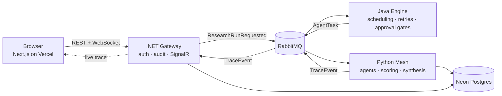

<p align="center">
  
</p>

<h1 align="center">Consilience</h1>

<p align="center">
  Multi-agent research that converges on verified claims.<br/>
  Independent AI agents gather sources, extract claims, cross-check each other,
  flag contradictions, and produce a report with per-claim confidence and full attribution.
</p>

---

## What it does

Submit a research question. Consilience dispatches multiple specialized agents that work in parallel:

- **Gather** — each agent independently retrieves sources and extracts claims
- **Cross-check** — agents verify each other's findings and flag contradictions
- **Rank** — evidence is scored for source credibility
- **Converge** — a synthesis pass resolves conflicts into a final report with a confidence score per claim

You can watch the mesh work in real time (live trace of every agent action, source pull, and disagreement), intervene mid-run (approve/reject sources, redirect agents), and export the final cited report.

## Architecture

Polyglot by design — each service owns a responsibility its stack is genuinely best at:

| Service | Stack | Responsibility |
|---|---|---|
| [`apps/web`](apps/web) | Next.js (App Router) + TypeScript | Dashboard, live trace view, report UI |
| [`services/gateway`](services/gateway) | ASP.NET Core (C#) | Public API, Clerk auth, tenancy, audit log, SignalR trace streaming |
| [`services/mesh`](services/mesh) | Python | Agent runtime: orchestration, LLM routing, credibility scoring, contradiction detection, eval harness |
| [`services/engine`](services/engine) | Java | Workflow engine: job dispatch, retries/backoff, rate limiting, human-approval rules |



Services communicate through documented contracts in [`packages/contracts`](packages/contracts). Key decisions are recorded as ADRs in [`docs/adr`](docs/adr).

## Status

| Milestone | Scope | Status |
|---|---|---|
| 0 | Repo, architecture, brand, design system, DB + auth provisioning, CI | ✅ Shipped |
| 1 | Auth end-to-end (Clerk ↔ .NET gateway), dashboard shell, theme toggle | ✅ Shipped |
| 2 | Single-agent research flow, source retrieval, citations | ⏳ Next |
| 3 | Multi-agent mesh, contradiction detection, eval harness | Planned |
| 4 | Workflow engine: queue, retries, rate limits, approval gates | Planned |
| 5 | Real-time trace UI, report export | Planned |
| 6 | Security hardening audit | Planned |
| 7 | Full testing pass (unit/integration/e2e/load) | Planned |
| 8 | Legal & compliance (privacy, ToS, data handling) | Planned |
| 9 | Accessibility, performance, launch readiness | Planned |

See [CHANGELOG.md](CHANGELOG.md) for per-milestone detail.

## Local development

```bash
# Frontend
cd apps/web
npm install
cp ../../.env.example .env.local   # fill in values — see comments in the file
npm run dev

# Gateway (requires .NET 10 SDK)
cd services/gateway/src/Consilience.Gateway
DATABASE_URL="postgresql://…" dotnet run   # http://localhost:5180
```

The dashboard footer shows live gateway session status: with the gateway running, it confirms the JWT verified end-to-end; without it, the app runs web-only. Remaining services (`mesh`, `engine`) gain run instructions as they come online in Milestones 2–4. All environment variables are documented in [`.env.example`](.env.example); no secrets are ever committed.

## Documentation

- [System architecture](docs/architecture/system-overview.md)
- [Architecture Decision Records](docs/adr)
- [Design system](apps/web/README.md) — tokens, type, color; live at `/styleguide`
