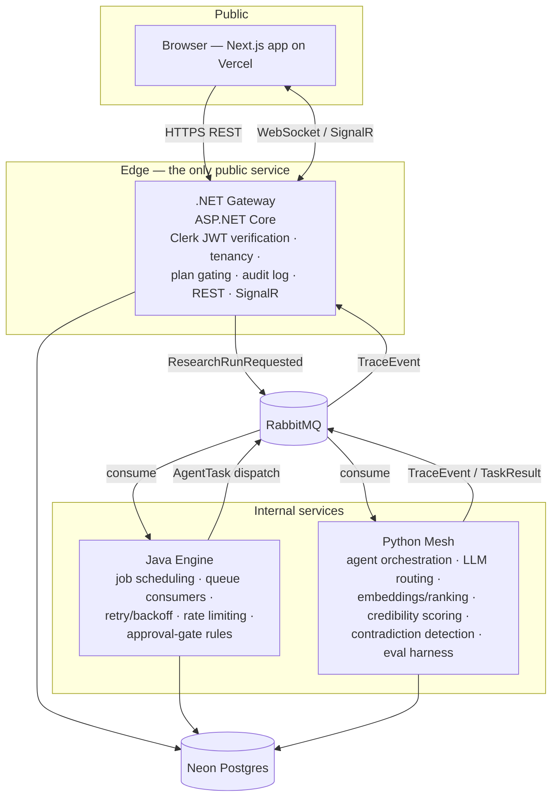

# System architecture

## Overview

Consilience is a polyglot system of four deployables coordinated through RabbitMQ and Neon Postgres. The .NET gateway is the **only** public-facing service; everything behind it communicates over the broker and documented REST/gRPC contracts.

## Run lifecycle

1. **Submit** — user posts a research question. Gateway verifies the Clerk JWT, checks plan limits, writes an audit entry, persists the run (owned by the user's tenant), and publishes `ResearchRunRequested`.
2. **Plan & dispatch** — the engine decomposes the run into agent tasks, enforces per-user rate limits, and publishes `AgentTask` messages. Failed tasks retry with exponential backoff via dead-letter exchanges.
3. **Research** — mesh workers consume tasks: retrieve sources, extract claims, embed and rank, cross-check sibling agents' claims, score credibility. Every step emits a `TraceEvent`.
4. **Checkpoint** — if the engine's rules require human approval (e.g., low-credibility source about to be cited), the run pauses and the user approves/rejects through the gateway.
5. **Converge** — a synthesis pass resolves contradictions and produces the final report with per-claim confidence.
6. **Stream & export** — `TraceEvent`s flow through the gateway's SignalR hub to the live trace view throughout; the final report is exportable with citations.

## Cross-cutting rules

- **Tenancy**: every table carries an owner ID; every query is scoped at the data layer, not just the API layer.
- **Contracts**: message schemas and REST/gRPC definitions live in [`packages/contracts`](../../packages/contracts) — the single source of truth for all four codebases.
- **Secrets**: environment variables only, documented in `.env.example`. Nothing sensitive is committed or logged.
- **Observability**: structured logs (INFO/WARN/ERROR) in every service; audit trail for sensitive actions; trace events double as debugging telemetry.

## Decision log

See [docs/adr](../adr) — start with [ADR-001 (polyglot architecture)](../adr/001-polyglot-architecture.md).
